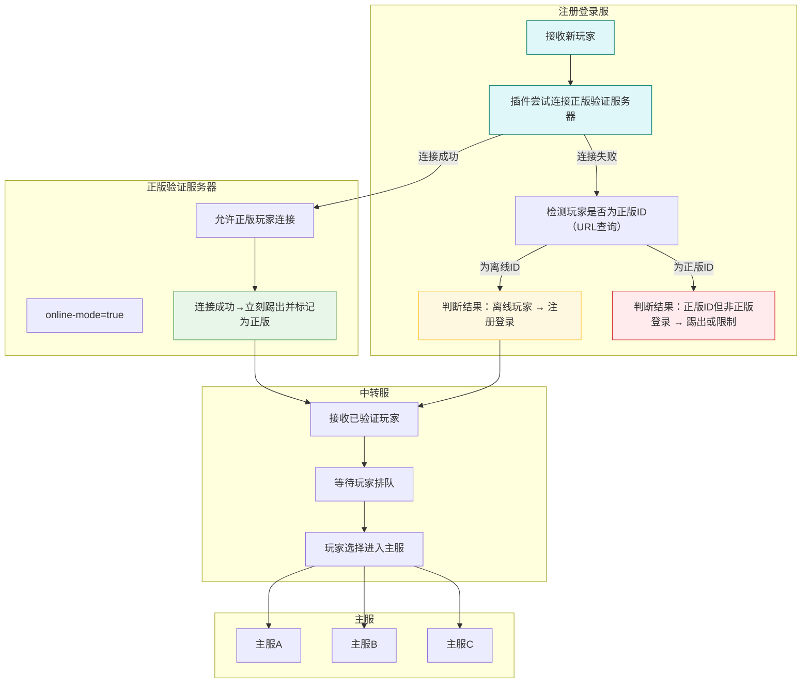

```mermaid
flowchart TD

    subgraph 注册登录服
        R1[接收新玩家]
        R2[插件尝试连接正版验证服务器]
        R3[检测玩家是否为正版ID（URL查询）]
        R4[判断结果：离线玩家 → 注册登录]
        R5[判断结果：正版ID但非正版登录 → 踢出或限制]
    end

    subgraph 正版验证服务器
        Z1[online-mode=true]
        Z2[允许正版玩家连接]
        Z3[连接成功→立刻踢出并标记为正版]
    end

    subgraph 中转服
        T1[接收已验证玩家]
        T2[等待玩家排队]
        T3[玩家选择进入主服]
    end

    subgraph 主服
        S1[主服A]
        S2[主服B]
        S3[主服C]
    end

    %% 流程线条
    R1 --> R2
    R2 -->|连接成功| Z2
    Z2 --> Z3 --> T1

    R2 -->|连接失败| R3
    R3 -->|为正版ID| R5
    R3 -->|为离线ID| R4
    R4 --> T1

    T1 --> T2 --> T3
    T3 --> S1 & S2 & S3

    %% 样式
    style R1 fill:#e0f7fa,stroke:#00796b
    style R2 fill:#e0f7fa,stroke:#00796b
    style R4 fill:#fff8e1,stroke:#fbc02d
    style R5 fill:#ffebee,stroke:#d32f2f
    style Z3 fill:#e8f5e9,stroke:#388e3c
```
